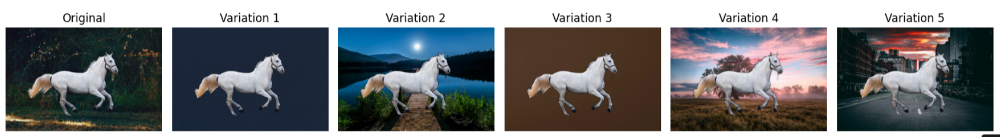

# Background Variator

This project demonstrates a simple yet effective way to remove the background of an image using AI (Rembg) and replace it with multiple visually appealing backgrounds. It can be used for content creation, product showcases, profile pictures, or any other creative application where background flexibility is desired.

## Features

- Automatically downloads and saves the input image.
- Removes background using `rembg`.
- Replaces background with multiple preset image URLs.
- Saves the output images in high quality.
- Displays all variations side-by-side using `matplotlib`.

  ---

  ## Example Output
  

## Technologies Used

- Python 3
- [rembg](https://github.com/danielgatis/rembg) for background removal
- PIL (Pillow) for image processing
- matplotlib for visualization
- requests for image downloading
- io for byte conversion

## Author
Built by **Mariyam Chauhdry** - AI Engineer
Feel Free to connect on [LinkedIn](https://www.linkedin.com/in/mariyam-chauhdry-592231270)

